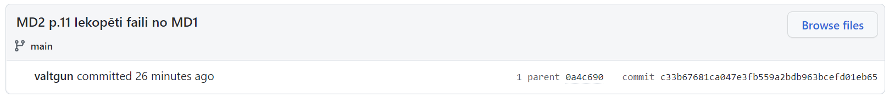

# 2.Tēma

## 9. Salīdzināt lokālā un github commit hash  
Hash abiem commit ir vienādi: c33b67681ca047e3fb559a2bdb963bcefd01eb65

Lokālais commit hash:  
> > $ git show  
> > commit c33b67681ca047e3fb559a2bdb963bcefd01eb65 (HEAD -> main, origin/main, origin/HEAD)  
> > Author: valtgun <valtgun1@outlook.com>  
> > Date:   Thu Apr 28 07:40:42 2022 +0300  
> > MD2 p.11 Iekopēti faili no MD1  

Github commit hash:
  

----    
## 13. Hash salīdzīnāšana pārkopētiem failiem.  

Tika salīdzināts fails 01-HelloWorld.py  
Faili ir ar vienādiem hash, t.i. git neredz atšķirību stap šiem failiem.

Katalogā module_1:  
> > $ git cat-file -p main^{tree}:module_1  
> > 100644 blob aa5be9a16125124e9248e3d363b0add8df5a58e1    01-HelloWorld.py

Katalogā module_2:
> > $ git cat-file -p main^{tree}:module_2  
> > 100644 blob aa5be9a16125124e9248e3d363b0add8df5a58e1    01-HelloWorld.py
  
----
## 16. Atrast divus veidus kā pārbaudīt pēdējās nedēļas laikā veiktās izmaiņas

### Veids Nr.1 - git log since

Norādot relatīvo laiku  
> > git log --since=1.week

### Veids Nr.2 - git log after

Norādot absolūto laiku / datumus
> > git log --after={2022-04-21}

----
## 17. Atrast commit ko veica Laura Pacilio

> > git log --author="Laura Pacilio"
----
## 18. Atrast vai Laura Pacilio ir veikusi commit pagājušā gada septembrī?

> > git log --author="Laura Pacilio" --after={2021-09-01} --before={2022-09-30}

**Ir veikusi** commit pagājušā gada Septmbrī.

----
## 19. Atrast vai Laura Pacilio ir veikusi commit vakardien?

> > git log --author="Laura Pacilio" --since=1.day

**Nav veikusi** commit vakardien.

----
## * 16.aprīļa commit atlasot 20-21 aprīli.

> > git log --after={2021-04-20} --before={2022-04-21}

Atrasts commit:

> > commit d4776e8ef106aaf1ad3f8b7aa38d0d846681cb7d  
> > Author: Martin Atkins <mart@degeneration.co.uk>  
> > Date:   Fri Apr 15 14:06:25 2022 -0700  
> > lang/funcs: type conversion functions can convert null values  

Skaidrojums: 

Izmantojot paplašināto git log izvadu var redzēt papildus detaļas. 
Kā arī to, ka atšķirās AuthorDate un CommitDate.  
Commit Date ietilpst izvēlētajā intervālā, bet pirmā veiktā komanda uzrāda AuthorDate, tādēļ radās datumu attēlošanas nesakritība.

Komanda:  
> > git log --after={2021-04-20} --before={2022-04-21} --stat --all --decorate --graph --pretty=fuller  

Rezultāts:
> > * | | commit d4776e8ef106aaf1ad3f8b7aa38d0d846681cb7d  
> > | | | Author:     Martin Atkins <mart@degeneration.co.uk>  
> > | | | AuthorDate: Fri Apr 15 14:06:25 2022 -0700  
> > | | | Commit:     Martin Atkins <mart@degeneration.co.uk>  
> > | | | CommitDate: Wed Apr 20 09:09:12 2022 -0700>  

----

