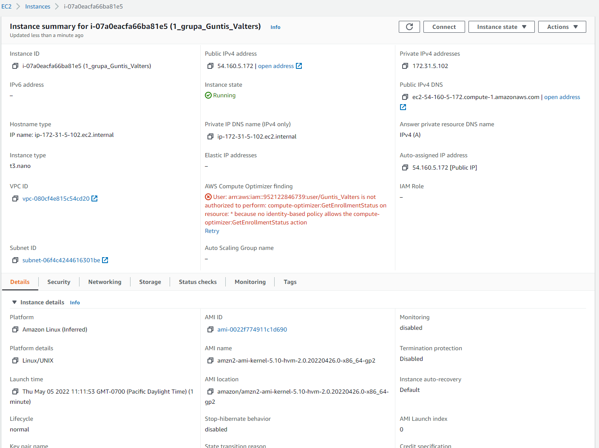

# 3.Tēma

## Izveidotā servera apraksts
  

## Sadaļu apraksts
### Details
Parāda pamatinformāciju par izveidoto serveri, piemēram:
- Operētājsistēmu  
- Uzstādītās sistēmas image Id un nosaukumu  
- Instances īpašnieku  
- Procesoru skaitu, u.c.  

### Security
Parāda informačiju par instances drošības uzstādījumiem, piemēram:  
- Identitātes un piekļuves pārvaldības (IAM) lomu  
- Ienākošos piekļuves nosacījumus, kā piemēram piekļuvi pie SSH 22 porta no noteiktas vai visām adresēm  
- Izejošos piekļuves nosacījumus, ja būtu nepieciešams atvērt portus lai šī instance piekļūtu ārējiem resursiem  

### Networking
Informācija par instances tīkla parametriem, piemēram:  
- IP adrese (v4 un ja ir tad v6)
- DNS nosaukums  
- Tīkla interfeisa parametri, u.c.

### Storage
Informācija par instancei piesaistītajiem diskiem, piemēram  
- Disku skaits, tips un apjoms  

### Status Checks
Instances stāvokļa pārbaude, lai konstatētu iespējamos iemeslus problēmu gadījumā

### Monitoring
Dažādu komponenšu noslodzes rādītāji, piemēram  
- Procesora, tīkla noslodze  
- Disku operācijas, u.c.  

### Tags
Instancei iespējams pievienot pašu izvēlētus tagus, lai pārvaldot lielāku apjomu ar serveriem, tos varētu vieglāk meklēt.

## Git repozitorija klonēšana
Nav iespējams pieslēgties pie servera konsoles, lai veiktu git repozitorija klonēšanu, jo nav veikta kāda no sekojošajām darbībām:  
- Instances drosības politikā uztādīta lietotājam atļauja izmantot EC2 Connect
- Nav izveidotas SSH atslēgas (SSH Key pair) lai varētu pieslēgites izmantojot SSH

